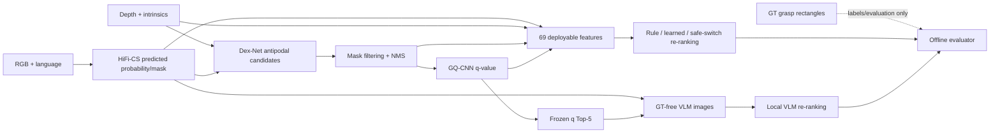

# Modular Candidate Re-ranking V1：实现说明

> 文档状态：工程实现说明，Run ID `20260728T210046+0100`。  
> 已完成的事实均链接到本机可复算产物；尚未完成的 validation、实验锁和 formal test 明确标为 `PENDING`。

## 1. 要解决的问题

现有系统先用 HiFi-CS 根据 RGB 图像和语言指令预测目标区域，再由 Dex-Net
从深度图中生成平行夹爪候选，最后由 GQ-CNN-2.1 给每个候选一个质量分数
`q`。本工作只在最后增加一个 candidate-level re-ranking 层。

最重要的边界是：

- 新方法只能重排已有 `candidate_id`；
- 不能生成、删除、移动、旋转或缩放任何抓取；
- `sample_id`、`candidate_id`、中心、角度、宽度、深度和
  `T_camera_grasp_fixed_approach` 必须保持不变；
- ground truth（GT）只能参与标签、训练、validation 选择和最终评价，不能进入
  inference 特征、VLM prompt、VLM 图像或 safe switch 输入。

> **像给 12 岁孩子解释**
>
> 想象桌上已经摆好了很多把“固定形状的小夹子”。本项目不能再造新夹子，也
> 不能偷偷挪动夹子，只能重新排列：“哪一把先试？”候选重排器就像一个更仔细
> 的裁判，它会看目标位置、深度、夹子宽度和周围障碍，但它不能看答案纸。

## 2. 数据流与 GT 隔离



源代码按职责分离：

| 职责 | 主要文件 |
|---|---|
| 基线和 Oracle Funnel | `src/grasping/reranking_v1/baseline_audit.py`, `labels.py` |
| 候选身份哈希 | `src/grasping/reranking_v1/identity.py` |
| split 泄漏审计 | `src/grasping/reranking_v1/split_audit.py` |
| 69 个候选特征 | `src/grasping/reranking_v1/features.py` |
| 规则和 learned ranker | `src/grasping/reranking_v1/models.py` |
| OOF safe switch | `src/grasping/reranking_v1/safe_switch.py` |
| 本地 VLM 后端和校验 | `src/grasping/reranking_v1/local_vlm.py` |
| VLM 图像 | `src/grasping/reranking_v1/vlm_visualization.py` |
| 独立评价和统计 | `src/grasping/reranking_v1/evaluation.py` |
| 实验锁 | `src/grasping/reranking_v1/experiment_lock.py` |
| 案例图 | `src/grasping/reranking_v1/gallery.py` |

命令行入口位于 `tools/modular_reranking/`，新产物统一写入
`outputs/modular_reranking_v1/<run-id>/`，没有与冻结旧输出混写。

## 3. “5 种候选抓法”是根据什么数据选出的

这里的 Top-5 不是五种人工设计的抓法，也不是 VLM 自己画出的五个框。其来源是：

1. HiFi-CS 用 **RGB + language** 预测目标概率图和目标 mask；
2. Dex-Net 的 antipodal sampler 用 **metric depth、相机内参和预测 mask**
   生成很多固定平行夹爪候选；
3. mask filter 去掉与预测目标不相符的候选；
4. NMS 去掉位置和角度过于相似的重复候选；
5. GQ-CNN-2.1 用候选对应的 **深度局部图和抓取姿态** 计算完整精度
   `q-value`；
6. 对 NMS 后候选按 `q-value` 从高到低排序，相同分数按 `candidate_id`
   确定性打破平局，最前五个就是 frozen GQ-CNN Top-5。

因此，Top-5 同时受到语言引导的预测 mask、可见深度几何、Dex-Net 采样和
GQ-CNN 深度质量判断影响。GT 抓取标注不参与候选产生或 Top-5 排序。

> **一句话版**
>
> 先让模型找到“你说的是哪个东西”，再从深度图里画出很多能夹的位置，去掉
> 重复项，最后由 GQ-CNN 给它们打分；分数最高的五个就是 Top-5。

## 4. 每候选特征

100-sample validation pilot 已生成 1,921 行、69 个 inference 特征，并在特征
计算完成后才连接 GT 标签。部署可用特征分为：

- GQ-CNN 质量：原始 `q`、样本内百分位、rank、Top-1 gap、邻域 q 统计；
- HiFi-CS soft mask：中心、抓取轴、左右 jaw、矩形支持、边界距离、局部熵；
- 宽度：米/像素宽度、最大夹爪比例、局部厚度和 mismatch；
- 可见深度与接触：中心/接触深度、深度梯度、depth edge、局部法线和对称性；
- visible-surface collision/clearance proxy：左右 finger、palm、approach
  corridor 占用率和 clearance；
- 候选关系：最近候选差异、候选矩形 IoU、pose cluster 和 uniqueness。

`approach_clearance` 是 0–1 的无量纲可见走廊清晰度分数，不是米制距离。
全部 collision/clearance 字段都只能称为
**visible-surface collision/clearance proxy**，不能称为完整碰撞保证。

特征契约证据：

- `outputs/modular_reranking_v1/20260728T210046+0100/features_val_pilot100/dataset_manifest.json`  
  SHA-256 `4ff28e483952245332a721884b292cc9c383facc5ca0604be2dabc5946eb2e2d`
- 其内部记录 `sample_count=100`、`candidate_count=1921`、
  `labels_joined_post_extraction=true`；
- `inference_feature_allowlist.json` 记录 69 个部署特征，
  `ground_truth_allowed=false`；
- `forbidden_gt_columns.json` 禁止 `candidate_positive`、GT IoU、GT angle、
  `first_valid_rank` 等字段进入 inference、VLM 或 safe gate。

## 5. 排序方法

### 5.1 Protocol A：完整 NMS pool

| 方法 | 核心思想 | 实现状态 | 正式实验状态 |
|---|---|---|---|
| `q_only` | 完整精度 q 降序 | 已实现 | validation/test `PENDING` |
| `q_softmask_rule` | 归一化 q 与 soft-mask support 加权 | 已实现 | validation 选参 `PENDING` |
| `geometry_gated_q` | 严重可见几何风险 penalty/veto 后按 q | 已实现 | validation 选参 `PENDING` |
| `regularized_linear_ranker` | 标准化特征上的正则 logistic 模型 | 已实现 | full development/validation `PENDING` |
| `pairwise_ranker` | 样本内正负 candidate 的 RankNet loss | 已实现 | full development/validation `PENDING` |
| `multi_positive_listwise_ranker` | 一个样本允许多个正候选 | 已实现 | full development/validation `PENDING` |
| `residual_mlp` | 有界 MLP residual 修正 q 排序 | 已实现 | full development/validation `PENDING` |
| `set_aware_residual` | candidate + 样本 mean/max 的 DeepSets residual | 已实现 | full development/validation `PENDING` |

学习式方法在输入处验证 split、有限值、完整 q 排名、候选身份 SHA-256 和
inference allowlist。residual 使用 `tanh` 约束修正范围，避免模型无限制地
推翻 GQ-CNN。

### 5.2 Protocol B：冻结 GQ-CNN Top-5

Top-5 protocol 只在原来的五个候选中改变顺序，用于 learned ranker 与 local
VLM 的公平比较：

- `q_top5`
- `tabular_residual_top5`
- `setrank_top5`
- `local_vlm_visual`
- `local_vlm_visual_metadata`
- `local_vlm_safe_switch`

Protocol A 的上限是 full NMS pool Oracle；Protocol B 的上限是 Top-5 pool
Oracle。二者不能混为同一个候选空间。

## 6. Safe switch

safe switch 比较：

- `old`：原始 GQ-CNN Top-1；
- `new`：reranker 提议的新 Top-1。

gate 只读取部署时可得的差值、ranker confidence、score entropy、候选集 q
统计和 geometry-safe 标志。训练标签来自 scene-grouped OOF 的
`beneficial/harmful/neutral` 结果，并且只在特征冻结之后连接。只有 gate
confidence 达到 validation 锁定阈值且新候选通过 geometry safety gate 时才
切换，否则 fail closed 回到原 Top-1。

validation 的预声明约束是 harmful rate 增量不超过 1 percentage point；最终
阈值和 primary 尚未锁定，状态为 `PENDING`。

## 7. “好抓法”和“坏抓法”的正式判断

候选为正只在同一个 GT rectangle 同时满足：

```text
rectangle IoU > 0.25
AND
180° periodic angle difference <= 30°
```

不能用 GT-A 通过 IoU、GT-B 通过角度再拼成“正确”。坐标约定是
`(x,y)=(u,v)`，不是 `(row,column)`。

这个标签表示与 OCID-VLG 的二维抓取标注一致，并不等于机器人真的能抓起来。
它不证明 force closure、无碰撞、可达性或 lift success。

> **像给 12 岁孩子解释**
>
> 把标准答案想成纸上的一个长方形。模型的长方形要和它重叠得够多，而且朝向
> 也要接近，两个条件必须同时及格。纸上答对不代表真实机器人一定抓得稳，就像
> 在地图上画对路线不代表路上一定没有坑。

## 8. 独立评价

独立 evaluator 支持：

- 全体样本和非空样本两种口径；
- J@1、Recall@5/10、J@Any、MRR、first-valid rank；
- 相对 q-only 的 Recovered、Harmful、Net Gain 和 switch precision；
- exact McNemar、Holm correction；
- scene-grouped bootstrap 95% CI（正式运行要求至少 10,000 draws）；
- VLM JSON、fallback、latency 和 token 统计；
- 输入 candidate universe 和 identity SHA-256 一致性检查；
- 输出后独立重算一致性检查。

正式 validation 统计、锁定配置和一次 formal test 均为 `PENDING`，不能从当前
smoke/pilot 结果推断最终胜者。

## 9. 已验证的工程证据

| 证据 | 结果 | 本机产物与 SHA-256 |
|---|---|---|
| 冻结 test baseline | 7,675 样本；严格 Top-1 2,833；Top-5 4,787 | `outputs/modular_reranking_v1/20260728T210046+0100/baseline_full/baseline_audit.json` — `44b9603e2949a35ae1798a878b713d221a5df73e0fc9c9122563ca53293b96f9` |
| split audit | sample/scene/RGB/depth/RGB-D pair 交集全为 0 | `outputs/modular_reranking_v1/20260728T210046+0100/split_audit/split_audit.json` — `a8a18ba4961edb04ebf83b6aa0fd4bcb02dfa23c622797f37e08252a881301f2` |
| 20-sample 全链路 repeat | 529 candidates；probability/mask/pose/q 完全一致 | `outputs/modular_reranking_v1/20260728T210046+0100/determinism_val_repeat20_full_pipeline.json` — `6cfda0ffb09fa482344e378c12f0bee232a1f7ea2f14ac2cd68efaf3419468bf` |
| 100-sample shard merge | 1,921 candidates 与单进程逐元素一致 | `outputs/modular_reranking_v1/20260728T210046+0100/shard_merge_val_pilot100_identity.json` — `e7b4a14aae62e33f74284a683611849f3aa2713837f913cfd1d40d8f8f20066e` |
| 100-sample GQ-CNN | 1,921/1,921 finite q；0 failed samples | `outputs/modular_reranking_v1/20260728T210046+0100/gqcnn_val_pilot100/run_statistics.json` — `3eceff5112f857fde978c3fa3bfd812328a8cdb30a09b8e47abdc0bb763708ba` |
| local VLM audit | cloud disabled；loopback only；model digest pinned | `artifacts/experiment/modular_reranking_v1_20260728T210046+0100/local_ollama_audit_v2.json` — `7fd3f799da95fc252f413081383f4795afe465e72db1c0b35fa446af12d85fc6` |
| 相关测试 | 90 passed in 14.00 s | 测试源码哈希和明确缺口见 `MODULAR_RERANKING_V1_AUDIT.md` |

## 10. 外部参考与复用决定

只使用官方来源核对运行契约：

- [Ollama local-only FAQ](https://docs.ollama.com/faq)
- [Ollama structured outputs](https://docs.ollama.com/capabilities/structured-outputs)
- [Ollama vision](https://docs.ollama.com/capabilities/vision)
- [Ollama Qwen3-VL tags](https://ollama.com/library/qwen3-vl/tags)
- [Qwen3-VL official repository](https://github.com/QwenLM/Qwen3-VL)

没有复制外部实现代码；官方资料只用于核对 model tag、digest、license、
local-only 配置和 JSON schema API。算法实现来自本仓库现有数据契约和新增的
本地可测试代码。

## 11. 待最终产物回填

- `PENDING`：full development 和 full validation 特征/评分；
- `PENDING`：scene-grouped 3-fold OOF 模型和 safe gate；
- `PENDING`：validation 方法选择与 threshold sweep；
- `PENDING`：不可变 `frozen_experiment_manifest.json`；
- `PENDING`：formal test invocation counter 从 0 变为 1；
- `PENDING`：正式统计、完整案例图库和最终 primary。

在这些条目完成前，本文件不能被引用为“最终方法已胜出”的证据。
