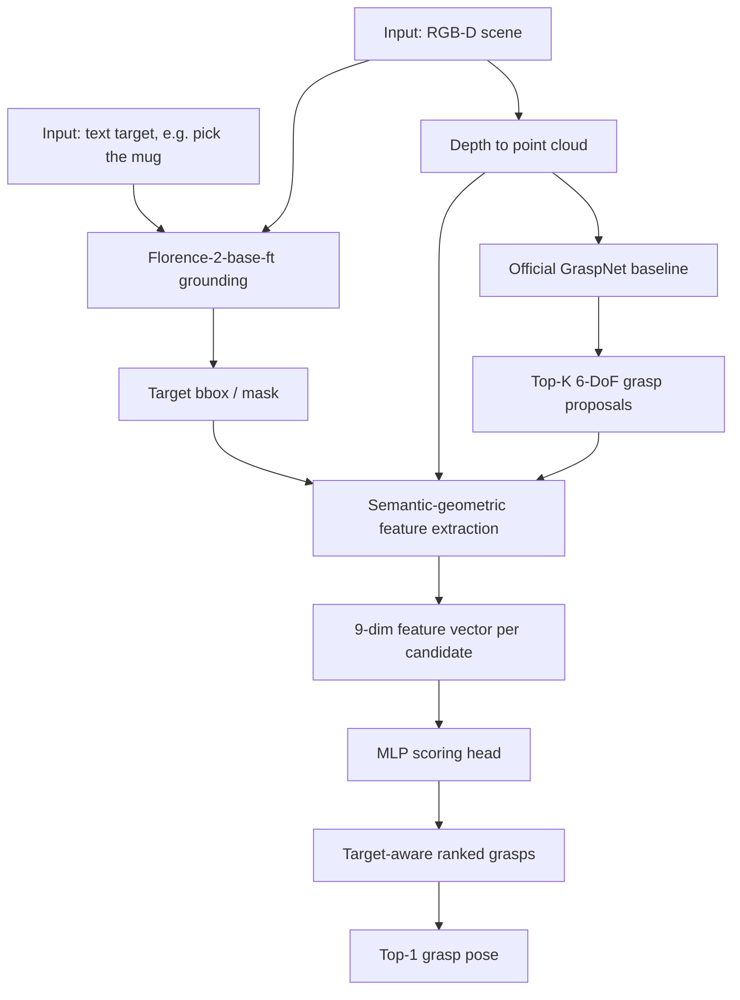

# VLMGraspPose

**Target-aware 6-DoF grasp selection with Florence-2-base, GraspNet baseline, and an MLP semantic-geometric reranker.**

This repository is a local, script-driven research pipeline for the following
framework:

```text
RGB-D scene + text target
  -> Florence-2-base-ft target grounding
  -> full-scene GraspNet baseline proposals
  -> semantic-geometric feature extraction
  -> MLP scoring head
  -> top-K / top-1 target-aware 6-DoF grasp
```

Dataset files are expected in the official GraspNet-1Billion layout under
`data/raw/graspnet/`, and model weights are downloaded from Hugging Face /
Google Drive with the provided scripts.

## Architecture



## Implemented Stack

| Stage | Implementation |
|---|---|
| Target grounding | `microsoft/Florence-2-base-ft`, frozen, `seg` by default |
| Grasp proposals | Official `graspnet/graspnet-baseline`, RealSense checkpoint by default |
| Feature vector | 9 semantic-geometric features in camera frame |
| Scoring | `MLPReranker`, 2-layer MLP scoring head |
| Evaluation | Target-ranking metrics: Success@K, Precision@K, AP |

The older rule/logistic/pairwise rerankers and antipodal sampler remain importable
for regression tests and legacy artifacts, but the default local path is
`Florence-2-base-ft + GraspNet baseline + MLP`.

## Local Setup

### 1. Python Environment

```bash
python -m venv .venv
source .venv/bin/activate
pip install -r requirements.txt
```

### 2. Install Official GraspNet Baseline

The GraspNet baseline contains compiled CUDA/C++ operators, so it is not vendored
inside this repository.

```bash
mkdir -p external
git clone https://github.com/graspnet/graspnet-baseline external/graspnet-baseline

cd external/graspnet-baseline
pip install -r requirements.txt

cd pointnet2
python setup.py install

cd ../knn
python setup.py install

cd ../..
git clone https://github.com/graspnet/graspnetAPI external/graspnetAPI
cd external/graspnetAPI
pip install -e .
cd ../..
```

If you keep the baseline somewhere else, set:

```bash
export GRASPNET_BASELINE_ROOT=/absolute/path/to/graspnet-baseline
```

### 3. Download Data and Weights

```bash
# GraspNet data into data/raw/graspnet/
python scripts/download_data.py --all

# Florence-2-base-ft and GraspNet RealSense checkpoint
python scripts/download_weights.py --all --camera realsense
```

For a smaller first run, download only the test split and required labels, then
run the pipeline on `test_seen` or a small `--max-samples` subset.

## Run Pipeline

Run the steps in order:

```bash
# Step 1: index GraspNet views
python scripts/step01_build_index.py

# Step 2: create text queries from visible object IDs
python scripts/step02_create_queries.py

# Step 3: build oracle target boxes/masks from GT labels
python scripts/step03_oracle_targets.py

# Step 4: run Florence-2-base-ft grounding
python scripts/step04_florence_grounding.py --splits train val test_seen

# Step 5: convert depth maps to point clouds
python scripts/step05_depth_to_pcd.py

# Step 6: generate full-scene GraspNet baseline candidates
python scripts/step06_grasp_candidates.py --splits train val test_seen

# Step 7: build target-aware labels for MLP training
python scripts/step07_build_labels.py --splits train val

# Step 8: extract semantic-geometric features
python scripts/step08_extract_features.py --splits train val

# Step 9: train the MLP scoring head
python scripts/step09_train_reranker.py --model mlp --grounding predicted

# Step 10: run full inference
python scripts/step10_inference.py --splits test_seen

# Step 11: evaluate target-aware ranking
python scripts/step11_evaluate.py --splits test_seen --grounder seg --reranker mlp --detector graspnet
```

Default configuration is centralized in `config.py`:

```python
DEFAULT_GROUNDING = "seg"
DEFAULT_DETECTOR = "graspnet"
DEFAULT_RERANKER = "mlp"
FLORENCE2_MODEL_ID = "microsoft/Florence-2-base-ft"
```

## Feature Vector

Each grasp candidate is represented by 9 features:

| Feature | Meaning |
|---|---|
| `detector_score` | GraspNet baseline score |
| `dist_target_3d` | 3D distance from grasp center to target centroid |
| `proj_dist_2d` | 2D projected distance to target center |
| `proj_overlap` | Projected overlap with target bbox/mask |
| `target_points_ratio` | Fraction of target-mask points near gripper |
| `nontarget_points_ratio` | Fraction of non-target points near gripper |
| `collision_risk` | Local geometry collision heuristic |
| `depth_consistency` | Grasp depth consistency with target region |
| `florence_conf` | Grounding confidence placeholder; Florence-2 does not expose calibrated confidence |

## Outputs

| Directory | Contents |
|---|---|
| `derived/grounding_pred/` | Florence-2 grounding results |
| `derived/pointclouds/` | View-level point clouds |
| `derived/grasp_candidates/graspnet/` | GraspNet candidate caches |
| `derived/rank_features/` | Feature parquet files |
| `derived/rank_labels/` | Training label parquet files |
| `models/` | Florence-2, GraspNet checkpoint, trained MLP |
| `results/` | Predictions and metrics |

## Evaluation Scope

The implemented metrics evaluate target-aware ranking:

- `Target Success@1`
- `Target Success@5`
- `Precision@K`
- target-ranking `Average Precision`
- failure rate

They do **not** claim physical grasp execution success, force closure, or
official GraspNet μ-AP. Robot execution is out of scope for this local pipeline.

## Visualization

```bash
python -m vis.vis_2d --sample <sample_id> --grounder seg --reranker mlp
python -m vis.vis_3d --sample <sample_id> --grounder seg --reranker mlp
python -m vis.compare_gt --grounder seg --reranker mlp
```

Visualization outputs are written to `vis_output/`.

## Troubleshooting

If Step 6 fails with an import error, check:

```bash
echo $GRASPNET_BASELINE_ROOT
python -c "from graspnetAPI import GraspGroup; print('graspnetAPI ok')"
python -c "import sys; sys.path.insert(0, 'external/graspnet-baseline/models'); from graspnet import GraspNet, pred_decode; print('baseline ok')"
```

If Step 10 fails because no MLP checkpoint is found, run Step 9 first. Inference
with `--reranker mlp` intentionally fails rather than silently using an untrained
scorer.

## License

MIT for this repository. GraspNet data, code, and checkpoints are governed by
their upstream licenses and non-commercial terms.
