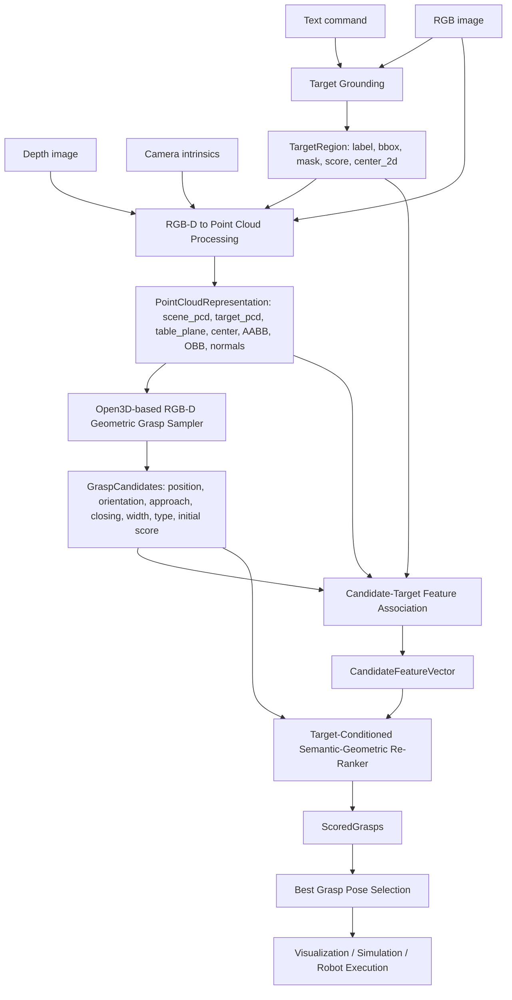

# VLMGraspPose

Language-guided target-aware RGB-D grasping pipeline.

Core flow:

```text
Text Command + RGB-D Image
-> Target Grounding
-> Target Point Cloud Extraction
-> Open3D-based RGB-D Geometric Grasp Sampler
-> Target-Conditioned Semantic-Geometric Re-Ranker
-> Best Grasp Pose Selection
-> Simulation / Robot Execution
```

The project no longer uses Kaggle code paths, official GraspNet baseline
inference, or CUDA-only grasp proposal networks. The local proposal module is
`RGBDGeometricGraspSampler`, which runs from target RGB-D point-cloud geometry.

Dataset files are expected under:

```text
data/raw/graspnet/scenes/scene_0000 ... scene_0189
```

## Architecture



## Module Contracts

### Module 0: System Input

Input:

```text
Text command: "pick the red mug"
RGB image: H x W x 3
Depth image: H x W
Camera intrinsics: fx, fy, cx, cy
```

Output:

```text
Raw observation bundle used by every downstream module.
```

Why this output is needed:

Language tells the system what to pick. RGB localizes visual target regions.
Depth and intrinsics convert pixels into metric 3D points.

Next module use:

`Target Grounding` consumes text + RGB. `Point Cloud Processing` consumes RGB-D
and intrinsics.

### Module 1: Target Grounding

Implementation:

```text
src/grounding.py
scripts/step04_florence_grounding.py
Default model: microsoft/Florence-2-base-ft
```

Input:

```text
Text command
RGB image
```

Output:

```python
TargetRegion = {
    "label": "red mug",
    "bbox": [x1, y1, x2, y2],
    "mask": "H x W binary mask or None",
    "grounding_score": 1.0,
    "center_2d": [u, v],
}
```

Why this output is needed:

It identifies the user-specified object. The bbox/mask defines where to extract
the target point cloud. The score is a confidence channel for reranking.

Next module use:

`Target Point Cloud Extraction` uses bbox/mask to isolate target RGB-D points.
`Candidate-Target Association` uses bbox/mask/score to compute target-aware
features.

### Module 2: Target Point Cloud Extraction

Implementation:

```text
src/target_point_cloud.py
src/point_cloud.py
scripts/step05_depth_to_pcd.py
```

Input:

```text
RGB image
Depth image
Camera intrinsics
TargetRegion bbox / mask
```

Output:

```python
PointCloudRepresentation = {
    "scene_pcd": "all valid RGB-D scene points",
    "target_pcd": "raw target points from mask or bbox",
    "clean_target_pcd": "Open3D-denoised/downsampled target cloud",
    "table_plane": [a, b, c, d] or None,
    "target_center_3d": [x, y, z],
    "target_aabb": {"min": [...], "max": [...], "extent": [...]},
    "target_obb": {"center": [...], "rotation": [...], "extent": [...]},
    "surface_normals": "N x 3 target normals",
}
```

Why this output is needed:

The sampler needs 3D target shape, size, pose, normals, and table context. The
scene cloud remains available for collision and evaluation.

Next module use:

`RGBDGeometricGraspSampler` uses `clean_target_pcd`. Feature association uses
target center, target points, scene points, and table/geometry cues.

### Module 3: Open3D-based RGB-D Geometric Grasp Sampler

Implementation:

```text
src/grasp_detector.py
scripts/step06_grasp_candidates.py
```

Input:

```python
SamplerInput = {
    "clean_target_pcd": target points,
    "surface_normals": target normals,
    "target_obb": oriented bounding box,
    "table_plane": optional plane,
    "gripper_config": {
        "min_width": 0.02,
        "max_width": 0.10,
    },
}
```

Output:

```python
GraspCandidate = {
    "position": [x, y, z],
    "orientation": "3 x 3 rotation matrix flattened",
    "approach_vector": [ax, ay, az],
    "closing_direction": [cx, cy, cz],
    "gripper_width": 0.045,
    "grasp_type": "normal_based",
    "initial_geometric_score": 0.72,
}
```

Why this output is needed:

It proposes physically meaningful 6-DoF grasp poses from target geometry. It is
not the final decision; it only creates candidate actions.

Next module use:

`Candidate-Target Association` computes a feature vector for every candidate.
`Re-Ranker` uses the candidate pose and initial score as part of final scoring.

### Module 4: Candidate-Target Feature Association

Implementation:

```text
src/feature_extractor.py
scripts/step08_extract_features.py
```

Input:

```text
GraspCandidates
TargetRegion
PointCloudRepresentation
Depth image
Camera intrinsics
```

Output:

```python
CandidateFeatureVector = {
    "target_overlap": 0.82,
    "center_alignment": 0.76,
    "distance_to_target_center": 0.028,
    "gripper_width_match": 0.91,
    "approach_direction_score": 0.80,
    "depth_stability": 0.74,
    "collision_penalty": 0.12,
    "boundary_penalty": 0.18,
    "initial_geometric_score": 0.72,
    "grounding_score": 1.0,
}
```

Why this output is needed:

The sampler only says what is geometrically plausible. These features measure
whether the candidate is aligned with the specified target and safe enough to
execute.

Next module use:

The MLP re-ranker consumes this vector and outputs a final target-conditioned
score.

### Module 5: Target-Conditioned Semantic-Geometric Re-Ranker

Implementation:

```text
src/reranker.py
scripts/step09_train_reranker.py
```

Input:

```text
GraspCandidates
CandidateFeatureVectors
Grounding confidence
```

Output:

```python
ScoredGrasp = {
    "candidate": "GraspCandidate fields",
    "feature_vector": [...],
    "final_score": 0.86,
    "rank": 1,
}
```

Why this output is needed:

The system must choose the grasp most likely to pick the intended object, not
just any stable grasp.

Next module use:

`Best Grasp Pose Selector` takes the ranked list and emits Top-1 plus fallback
grasps.

### Module 6: Best Grasp Pose Selection

Implementation:

```text
src/reranker.py select_top_k()
scripts/step10_inference.py
```

Input:

```text
ScoredGrasps
```

Output:

```python
BestGrasp = {
    "position": [x, y, z],
    "orientation": "3 x 3 rotation matrix flattened",
    "approach_vector": [ax, ay, az],
    "closing_direction": [cx, cy, cz],
    "gripper_width": 0.045,
    "score": 0.86,
    "fallback_grasps": ["rank 2", "rank 3", "rank 4"],
}
```

Why this output is needed:

It is the executable grasp command. Top-K fallback grasps allow retry without
rerunning the complete perception pipeline.

Next module use:

Visualization, simulation, or robot execution consumes the final pose.

### Module 7: Visualization / Simulation / Robot Execution

Implementation:

```text
vis/
scripts/step10_inference.py output JSON
```

Input:

```text
BestGrasp
Top-K ScoredGrasps
Scene point cloud
Target point cloud
Robot model optional
```

Output:

```text
Visualization: scene cloud, target cloud, candidates, best grasp
Simulation: success/failure, collision, lift result
Robot: pre-grasp pose, grasp pose, close gripper, lift pose
```

Why this output is needed:

It supports debugging, reporting, and eventual execution. Real robot execution
is optional and outside the required local pipeline.

## Run Pipeline

```bash
python scripts/step01_build_index.py
python scripts/step02_create_queries.py
python scripts/step03_oracle_targets.py
python scripts/step04_florence_grounding.py --splits train val test_seen --task seg
python scripts/step05_depth_to_pcd.py
python scripts/step06_grasp_candidates.py --splits train val test_seen --grounding predicted --task seg --detector geometric
python scripts/step07_build_labels.py --splits train val --detector geometric
python scripts/step08_extract_features.py --splits train val --grounding predicted --task seg --detector geometric
python scripts/step09_train_reranker.py --model mlp --grounding predicted --detector geometric
python scripts/step10_inference.py --splits test_seen --grounder seg --reranker mlp --detector geometric
python scripts/step11_evaluate.py --splits test_seen --grounder seg --reranker mlp --detector geometric
```

For a fast smoke test, pass `--max-samples` to Step 4 and Step 10, and restrict
`--splits` to one split.

## Outputs

| Path | Contents |
|---|---|
| `derived/grounding_pred/` | TargetRegion records and predicted masks |
| `derived/pointclouds/` | View-level RGB-D scene point clouds |
| `derived/grasp_candidates/geometric/` | Target-level grasp candidate caches keyed by `sample_id` |
| `derived/rank_features/` | CandidateFeatureVector parquet files |
| `derived/rank_labels/` | Training labels for target-conditioned reranking |
| `models/reranker_mlp_geometric_predicted.pt` | Trained MLP scoring head |
| `results/` | BestGrasp, Top-K fallback grasps, metrics |

## Current Scope

Included:

- Florence-2-base-ft target grounding
- Target point-cloud extraction with Open3D fallback behavior
- Open3D-based RGB-D geometric grasp sampling
- Target-conditioned semantic-geometric features
- MLP scoring head
- Target-aware offline evaluation and visualization outputs

Not included:

- Official GraspNet baseline inference
- Kaggle-specific paths or notebooks
- CUDA-only custom grasp proposal operators
- End-to-end VLM-to-6DoF training
- Guaranteed robot hardware execution
